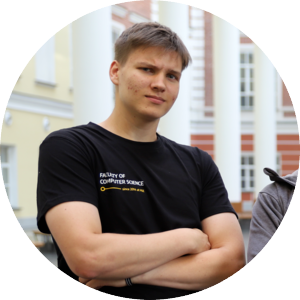

<!-- center -->

# Vladimir Babushkin

## **18 y.o. software engineer from hse moscow**

> *Лето!*
> 
> *Я изжарен, как котлета*
>
> *Время есть, а денег нету,*
>
> *Но мне на это наплевать*

---
    
  <a href="#skills"> skills |<a href="#ach"> achievements |<a href="#exp"> experience |<a href="#edu"> education |<a href="#links"> links   

 ---

### <a id="skills">skills

* python

* c++

* sql

* html

* css

* javascript

* english b1-b2

---

### <a id="ach">achievements

* prize-winner of Open Olimpiad for School Students in Informatics

* winner of KFU olimpiad in Math

* winner of Team Olimpiad in programming in Eastern Siberia

* gold medal for excellent studying in Phys. Math. School of SFU

* orange judo belt

* top10 of knowlers What?Where?When? in SFU 22'

___

### <a id="exp"> experience

  I never have a job yet  :/

---

### <a id="edu">education

* main
    1. [Kindergarten №1](https://dou24.ru/1/) 11', Krasnoyarsk, Russia
    2. [Gymnasium №16](http://gim16.ru/) 21', Krasnoyarsk, Russia
    3. [Phys. Math. School of SFU](https://fms.sfu-kras.ru/) 23', Krasnoyarsk, Russia
    4. [Bacheloar of Software Engineering in FCS HSE](https://www.hse.ru/ba/se/) 27', Moscow, Russia
* extra
    1. [summer school of programming NlogN](https://nlogn.info/camp) 22'
    2. [Krasnoyarsk summer school](https://vk.com/klsh_ru) 22'
    3. [summer school of data analysis in FCS HSE](https://cs.hse.ru/dataschool/) 23'

---

### <a id="links"> links

email : [babushkinvova05@gmail.com](babushkinvova05@gmail.com)

tg : [@babushkin05](https://t.me/babushkin05)

vk : [@babushkin05](https://vk.com/babushkin05)

github: [@babushkin05](https://github.com/Babushkin05)

codeforces: [@babushkin_](https://codeforces.com/profile/babushkin_)

kaggle : [vladimirbabushkin](https://www.kaggle.com/vladimirbabushkin)

~~inst : [babushkin_](https://www.instagram.com/babushkin_/)~~

---
made by vladimir babushkin, 2023
